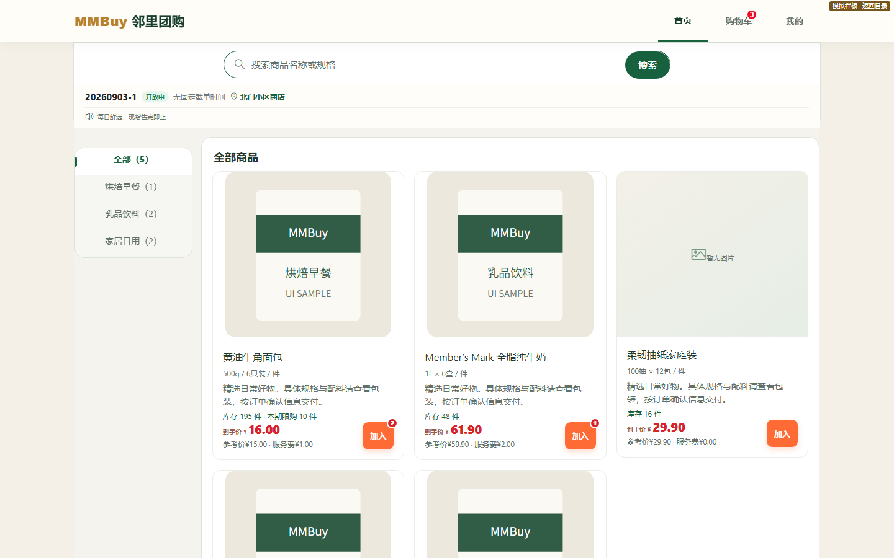
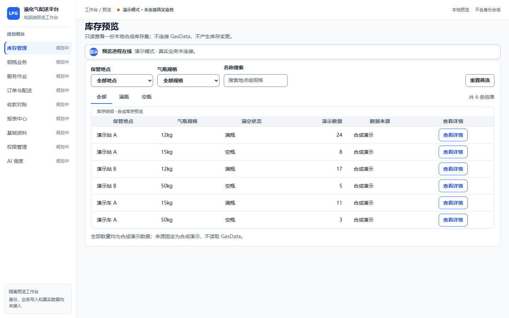

  

<h1 align="center">Haike Products</h1>

  Public product portfolio for Haike Information, an enterprise software company building systems for complex industry workflows.

  <a href="https://www.haike.online/en/"><strong>Visit Our Website</strong></a>
  &nbsp;·&nbsp;
  <a href="mailto:admin@haike.online?subject=Product%20enquiry"><strong>Discuss a Product</strong></a>

## Product Portfolio

This repository contains public-safe product demonstrations only. Screens use fictional or synthetic data and do not contain customer records, production credentials, private infrastructure details, or commercial source code.

### MMBuy

**Status: In active development**

An operations platform for community purchasing and group buying. MMBuy connects products, orders, procurement, inventory, pickup, payments, refunds, and after-sales support in one workflow.

  

<em>Running frontend preview · Synthetic products and inventory · No production database</em>

- Product and buying-round management
- Procurement, receiving, and stock coordination
- Pickup, payment, refund, and after-sales workflows

[Explore MMBuy on our website →](https://www.haike.online/en/projects/mmbuy/)

### Automotive Repair Management Platform

**Status: In development**

A workflow platform for repair businesses, designed to make appointments, work orders, quotations, service progress, quality checks, and settlement easier to coordinate.

  

<em>Isolated frontend preview · No personal identifiers · No production database or business API connected</em>

- Appointment and vehicle reception workflow
- Work orders, quotations, and service progress
- Quality inspection, settlement, and operating history

### Bottled Gas Delivery & Cylinder Management Platform

**Status: In development**

A digital operations platform for bottled-gas businesses, connecting customers, orders, delivery, cylinders, safety, inventory, and business management for clearer collaboration and traceable operations.

  

<em>Isolated desktop preview · Synthetic data · No connection to real operations</em>

- Order, delivery, and service workflows
- Cylinder inventory and traceability
- Safety management and operational visibility

## How We Build

We begin with the real operating workflow, clarify data and responsibility boundaries, and then develop the product in verifiable increments.

**Discovery → Solution Design → Development → Testing & Launch → Training & Handover → Ongoing Support**

## Cloud Platform Direction

As these products evolve, Haike Information is evaluating Cloudflare for edge delivery, application security, object storage, and reliable access across regions. Our goal is a secure, cost-aware cloud foundation that can grow with real product usage.

## About Haike Information

Haike Information builds enterprise software, industry digital solutions, and applied AI products for complex operational workflows.

**威海海克信息科技有限公司**

## Contact

- Website: [www.haike.online](https://www.haike.online/en/)
- Email: [admin@haike.online](mailto:admin@haike.online)

---

This repository is a public product showcase. Commercial source code and private implementation materials remain in controlled private repositories.
